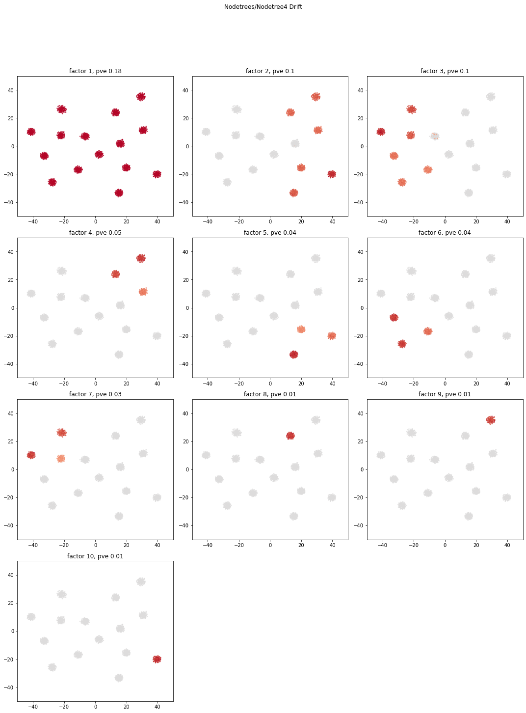
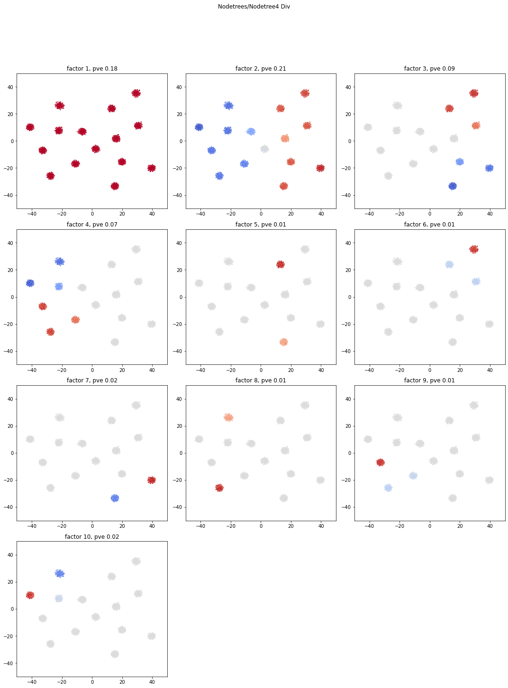
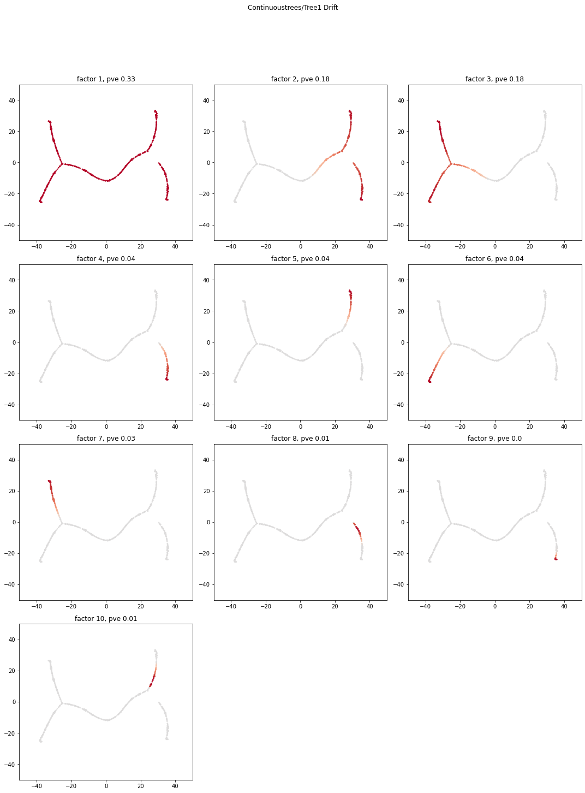
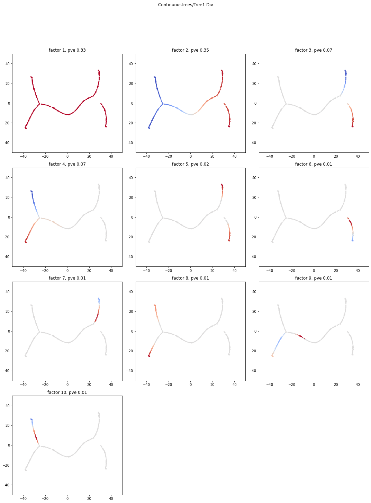

## Introduction

This analysis will explore using EBMF to detect tree structure in some synthetic data sets by computing either the drift or the divergence factorization. The functions used in this file are from `code/drift_div_factorizations.R`

```{r,message=FALSE}
source("code/drift_div_factorizations.R")
```

## The Data
I will be using two types of data sets in this analysis. All are based on the model of Brownian motion on a tree. The first type is data sets where the data is generated continuously along the branches of the tree. I call these data sets continuous trees. There are four continuous tree data sets in `data/ContinuousTrees`. The second type of data set is where the data is generated only around the nodes of the tree, which I call node trees. That is, for each node in the tree, a certain number of samples are drawn from a normal distribution centered at that node. There are nine node tree data sets in `data/NodeTrees`. A third type of data set of interest in some applications is where the data is only generated at the leaves of the tree. These data sets can be formed from node tree data sets by filtering on the column `IsLeaf`.

The function `form_tree_from_file` in `code/drift_div_factorizations.R` parses the raw data into a format that can be fed into the various methods. Below, we load one data set of each type.

```{r}
nodetree <- form_tree_from_file('data/NodeTrees/NodeTree4/NodeTree4.csv')
continuoustree <- form_tree_from_file('data/ContinuousTrees/tree1.csv')
```

One way to understand the trees is by examining their covariance matrix. For example, here is an image of the covariance matrix of the first node tree data set, where the spots in the matrix are colored by their value.
```{r}
image.plot(cov(t(nodetree$matrix)))
```
You can see that there are nested blocks in the matrix. Another way to understand the trees is by plotting a dimensionality reduction. These are saved as `tree$dimred`.
```{r}
plot(nodetree$dimred,col=1+nodetree$csv$Labels,bg="#808080")
```
That there are clusters of points around each nodes.

In contrast, here is the covariance matrix and dimensionality reduction of one of the continuous trees.
```{r}
image.plot(cov(t(continuoustree$matrix)))
plot(continuoustree$dimred,col=1+continuoustree$csv$Labels,bg="#808080")
```

## The Methods

The functions `drift_fit` and `div_fit` in `code/drift_div_factorizations.R` fit drift and divergence factorizations to the data using EBMF methods. It uses point-Laplace priors for divergence loadings, point-exponential priors for drift loadings, and normal priors on the factors. 

## Plotting Function

Here is a python plotting function that will be used to visualize the output of the EBMF algorithms. It plots the dimensionality reduction of the data colored so that points with positive loadings are red on a particular factor, and negative loadings are blue. How red or blue a point is corresponds to the magnitude of the loading. 

Below is the python code to generate the plots. I couldn't get python to play nicely with R markdown, though, so I have manually embedded the plots.

```{r setup, include=FALSE,eval=FALSE}
library(knitr)
library(reticulate)
knitr::knit_engines$set(python = reticulate::eng_python)
```

```{r,eval=FALSE}
import numpy as np
import pandas as pd
from matplotlib import pyplot as plt

def plot_ebnm_results(filename,method="drift"):
    #load computed factors and loadings
    if filename[-9:-1] == "NodeTree":
        data = pd.read_csv(f'data/{filename + "/"+ filename[-9:] }.csv')
    else:
        data = pd.read_csv(f'data/{filename}.csv')
    L = pd.read_csv(f"output/{filename}/EBMFfactors/{method}L.csv").values
    F = pd.read_csv(f"output/{filename}/EBMFfactors/{method}F.csv").values
    pve = pd.read_csv(f"output/{filename}/EBMFfactors/{method}pve.csv").values[:,0]

    #sort accorinding to pve
    srt = np.arange(len(pve))

    #plot
    plt.set_cmap('coolwarm')
    numfactors = L.shape[1]
    num_rows = int(numfactors/3)*3
    plt.figure(figsize=(15,num_rows*5))
    for k,factor,loading,pv in zip(range(numfactors),F.T[srt],L.T[srt],pve[srt]):
        ax = plt.subplot(num_rows,3,k+1)
        _max = max(abs(loading))
        ax.scatter(data.tsne0,data.tsne1,c=loading,alpha=.7,s=3,vmin=-_max,vmax=_max)
        ax.set_title(f'factor {k+1}, pve {np.round(pv,2)}')
        ax.set_xlim(-50,50)
        ax.set_ylim(-50,50)
    plt.suptitle(filename.title() + ' '+ method.title())
    plt.tight_layout(rect=[0, 0.03, 1, 0.95])
    plt.show()
```
## Performance on Node Trees
We run the methods on node trees.
```{r}
nodetree <- run_methods(nodetree,'output/NodeTrees/NodeTree4/EBMFfactors/',Kmax=10,eps = 2e-2)
```
Here is what the loadings look like for node tree 4.
```{python,eval=FALSE}
plot_ebnm_results("NodeTrees/NodeTree4","drift")
plot_ebnm_results("NodeTrees/NodeTree4","div")
```





## Performance on Continuous Trees
We now run the methods on continuous trees.
```{r}
continuoustree <- run_methods(continuoustree,'output/ContinuousTrees/tree1/EBMFfactors/',Kmax = 10,eps = 1e-2)
```
Here are plots of what the resulting loadings look like for tree 1.
```{python,eval=FALSE}    
plot_ebnm_results("ContinuousTrees/tree1","drift")
plot_ebnm_results("ContinuousTrees/tree1","div")
```





## Issues and questions to think about for drift factorization fits

* What should you choose eps to be? 
    * It probably makes sense to use the local false sign rate to decide if a loading should be nonzero.
* Stopping point-- it doesn't stop adding factors when it shouldn't, unfortunately. It does with node data, but not trajectory data
    * maybe some sort of spatial way of determining stopping? Like is this divergence you drawing a line in the sand, or is the split point close enough to the ancestral point that it's a reasonable split
* What happens with non-tree-shaped data?
    * If you put in non-tree-shaped data, you shouldn't detect structure that doesn't exist.
* This factorization doesn't quite give the true drift or divergence factorization because it gives continuous values instead of binary ones. Points that are more "specialized" have larger loadings than those that are less specialized. This doesn't quite match up with our definition of the divergence factorization.
* This works well with node datasets up to about 3 levels of splits. It breaks down a bit for 4 levels. This is likely due to the signal/noise ratio
* When and how should you backfit? Or should we stick with a simple greedy approach?
* The drift factorization seems more reliable in general than the divergence factorization in practice, but I'm not sure why.


